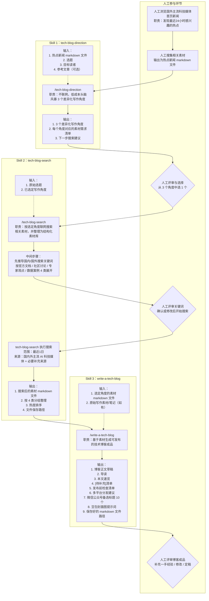

## 角度-搜索-撰写三段式AI辅助科技博客创作方法

本代码库提供一套“角度-搜索-撰写”三段式工作流（分别对应3个skill），帮助AI科技博主高效产出有深度、有差异化视角的 AI 科技技术博客。工作流由三个 GitHub Copilot CLI Skill 驱动，结合人工评审节点，实现从选题到可发布成品的全链路自动化。

### Template

#### 01-get-3-directions
```
/tech-blog-direction 帮我分析写作角度：选题是"XXX"，目标读者是"XXX"。参考文章参见"@my-ai-tech-blogs/reference-tech-blog.md"。
```

#### 02-pick-one-direction
```
/tech-blog-search 选择角度："xxx"
```

#### 04-draft-a-tech-blog
```
/write-a-tech-blog 请参考 "@my-ai-tech-blogs/tech-blog-search-result-<timestamp>.md"，然后将 "reference-tech-blog.md" 用中文进行改写，形成一份新的博客。新博客要求能吸引读者继续读下去，并能激发读者评论和转发。
```

### 安装 Skills

#### 前置条件

- 已安装支持 Skill 功能的 AI 编程助手客户端（能识别 `~/.claude/skills/` 目录，例如 Claude Code）

#### macOS / Linux

```bash
# 1. 克隆本代码库
git clone https://github.com/your-org/write-better-ai-tech-blogs-with-ai.git
cd write-better-ai-tech-blogs-with-ai

# 2. 确保目标目录存在
mkdir -p ~/.claude/skills

# 3. 将三个 skill 文件夹复制到个人 skills 目录
cp -r skills/tech-blog-direction ~/.claude/skills/
cp -r skills/tech-blog-search ~/.claude/skills/
cp -r skills/write-a-tech-blog ~/.claude/skills/
```

完成后，`~/.claude/skills/` 目录结构如下：

```
~/.claude/skills/
├── tech-blog-direction/
│   └── SKILL.md
├── tech-blog-search/
│   └── SKILL.md
└── write-a-tech-blog/
    └── SKILL.md
```

重启客户端后，三个 Skill 即可在对话中直接触发。

---

### 三个 Skill 简介

| Skill | 职责 | 是否联网 |
|---|---|---|
| `tech-blog-direction` | 低成本头脑风暴，输出 3 个差异化写作角度 | ❌ 不联网 |
| `tech-blog-search` | 按选定角度搜索最近 1 日国内外热点素材 | ✅ 联网搜索 |
| `write-a-tech-blog` | 将素材加工为可发布的技术博客成品 | ❌ 不联网 |

---

### 工作流总览



---

### 分步使用指南

#### 第一步（人工）：浏览热点，准备素材

人工浏览国内外主流 AI 科技媒体（如量子位、机器之心、TechCrunch、VentureBeat 等），找到最近 24 小时你感兴趣的热点，将相关内容整理为一个 markdown 文件备用。

---

#### 第二步（Skill 1）：锁定写作角度 — `tech-blog-direction`

**触发方式**（在 Copilot CLI 对话中说）：

> "帮我分析写作角度：选题是 `<你的选题>`，目标读者是 `<读者描述>`"

**必填输入**：
- 选题（例如："Claude Code 的 Sub-agent 并发编排"）
- 目标读者（例如："有 1 年以上 AI 辅助开发经验的工程师"）

**可选输入**：
- 参考文章（提供后，Skill 会主动绕开已被充分报道的角度）
- 热点新闻 markdown 文件内容

**输出**：3 个差异化写作角度，每个附有具体素材需求清单和下一步搜索建议。

> 💡 **人工评审节点**：阅读 3 个角度，选择最契合你当前读者痛点的一个，记住角度名称，用于下一步。

---

#### 第三步（Skill 2）：搜索热点素材 — `tech-blog-search`

**触发方式**：

> "帮我搜索这个角度的素材：选题是 `<选题>`，角度是 `<第二步选定的角度名称>`"

**Skill 会先输出搜索关键词供确认**，你可以修改后再开始搜索。确认后，Skill 自动搜索覆盖至少 10 家国内 + 10 家国外主流 AI 科技媒体，范围限定为**最近 1 日**。

**输出**：一个本地 markdown 素材文件（文件名格式：`tech-blog-search-YYYY-MM-DD--HH-mm.md`），包含按 4 类分组、按热度排序的 32～40 条素材：
1. 官方文档类
2. 社区讨论类
3. 专家观点类
4. 数据/案例类

> 💡 **人工评审节点**：快速浏览素材文件，确认覆盖面是否足够，如有遗漏可要求补充搜索。

---

#### 第四步（Skill 3）：生成博客成品 — `write-a-tech-blog`

**触发方式**：

> "帮我写博客"（并提供素材文件路径或直接粘贴素材内容）

**输入**：
- 第三步生成的素材 markdown 文件
- 你自己的一手笔记/案例/代码片段（可选，但强烈建议提供——这是博客差异化的核心）

**输出**（自动保存为本地 markdown 文件）：
1. 读者画像推断 + 一句话价值主张
2. 导读（150 字以内，按读者类型分流）
3. 本文速览（3 条要点速览）
4. 完整博客正文（2000～3500 字，含标题、代码块、架构图建议位置）
5. `[待补充]` 清单（一手经验待填项）
6. 发布前检查清单
7. 多平台分发建议（公众号 / 小红书 / 视频号 / CSDN）
8. 微信公众号备选标题 10 个（覆盖数字冲击型、技术名称型、认知颠覆型、行动感型）
9. 豆包封面图生成提示词

> 💡 **人工收尾节点**：补充 `[待补充]` 中的一手经验细节，修改定稿后发布。

---

### 关键设计原则

- **角度前置，避免无效搜索**：先通过 `tech-blog-direction` 锁定方向，再搜索，避免素材与文章方向脱节。
- **链接真实性红线**：`tech-blog-search` 严禁捏造链接，无法确认时标注"链接待核验"。
- **一手经验是差异化核心**：`write-a-tech-blog` 会用 `[待补充]` 标记所有需要你本人确认的内容，这些细节是 AI 无法伪造的价值所在。

---

### License

MIT